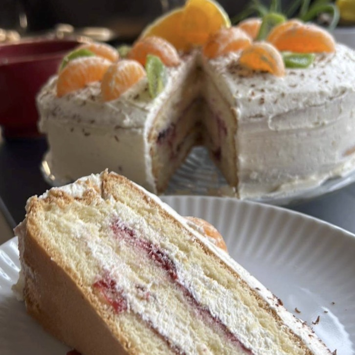

### Przemek

#### Intro

This page tries to be the "user manual" for Przemek (that's me) for those who want to interact with Przemek. It is intended to be helpful. Feel free to suggest changes if you think it is needed. I maintain it myself and try to be direct. If anything seems pretentious or overbearing, let me know so I can change it.

#### 📜 Bio

I've been a product manager for the bigger part of my professional career. Before that I worked for a couple companies in insurance industry. If you're interested in details, LinkedIn has it.

I graduated from Warsaw University of Technology, where I received my M.S. in production engineering. In information systems, to be more specific.

#### 😄 Name pronunciation hint

My full first name is actually Przemysław, but nobody ever called me that, not even my parents. Use Przemek. The phonetic spelling is p-sh-eh-m-eh-k and there's plenty audio samples online. Don't worry if you can't pronounce it, I won't mind it. I've been getting many emails starting with "Hi, Kulik" ("this Przemek thing can't be his first name, can it?") and it's fine. The best one I've ever got started with "Hi Kilimanjaro" - go figure 😄.

#### 🍅 Flaws

I like to think I am an open book, transparent and direct. I strive to live by these values. That's why I am sharing here some of the flaws I know I have. Listing them here is not an exacuse, I am fully responsible for improving on these things.

1. I look "serious" / "scary" most of the time. It's my "resting face". It's OK to remind me of that or ask what's going on.
2. English is my 3rd language. While I think it's fairly good, my choice of words and grammar may be off. If something in what I say/write does not seem right to you, feel free to ask and correct.
3. My tone of voice may seem harsh even if I don't mean it. I don't know if it's the Polish accent or something else. It's OK to remind me of that and say "that sounded harsh, I would appreciate a more calmer tone".
4. I tend to get emotional (angry, sad...). I know how it sounds, but it's not you, it's me. I'm working on it.
5. I may seem as difficult for work with. I hold myself to high standards. Sometimes it may seem like I'm "making it hard" for no apparent reason. The fault is mine. Feel free to stop me and ask clarifying "why" questions.
6. I sometimes fail or forget to recognize good effort or performance. I have seen it, believe me. It's OK to ask "how do you think I did there".

I'm sure I have more flaws that affect my professional life. Please contact me to have it added or if you prefer to do it anonymously, ask someone you and I both know, who woul dbe willing to submit it.

#### 🌟 Strengths

Still looking. I'm not trying to be coy here. Let me try with something basic and simple:

1. One of my managers used "pitbull attitude" in my yearly apprisal once. He meant it in a positive way. I'll take it.
2. If you're "one of my own" I will fight for you even if you mess up. Then, we'll talk.
3. I can be convinced. I have strong opinions but you can change them. Don't give up too early.

#### 👉 Pointers from others

They'll come as they come :)

#### 💬 Communication

##### Voice vs Text

I don't like writing long messages (emails, chats etc.). I understand there are needed sometimes, but I'd always prefer a short (or long) conversation over a long text.

##### Social media

I do have accounts on Facebook, Instagram, Twitter and LinkedIn. I use Facebook and Instagram for personal stuff only and I check them only during weekends.
I user Twitter and LinkedIn for professional stuff and I don't use them during weekends.

##### Don't assume anything

TL;DR: Check with me first.
As one of my flaws I documented above says, there's a chance I have misrepresented my own thoughts. Don't try to second guess me - ask for clarification. There's a chance that:

1. I never said "it"
2. I don't remmeber saying it
3. It's been misrepresented (possibly by myself)
4. "Now that you mention it, it doesn't seem right" might happen

##### Meeting requests

Just becase my calendar shows an empty slot, it doesn't mean it's available. I'm not always blocking time for personal / solo acttivities. If I decline your request I give a reason most of the time. Check back with me about possible time slots.

#### 👍 My interests

##### Sports

I do a lot and and I watch some. I practice Brazlilian Jiu Jitsu (I sometimes compete). I run. I lift weights. In this order. I do something almost every day.
I played footbal in the past and I like watching it.

##### Animals

I love animals. I currently have 2 cats. They're awesome :)

##### Reading

I like reading, a lot. Both fiction and non-fiction (less). I'm an urban fantasy fan. I can recommend some titles.

##### Cooking

I like doing things in the kitchen. I cook daily meals for myself and familly and I try new things I have seen travelling.

##### Watching / listening

I don't like wasting time, so when I'm in the car and not talking to somebody, I listen to podcasts. Topics vary but I stay away from politics, news etc.
